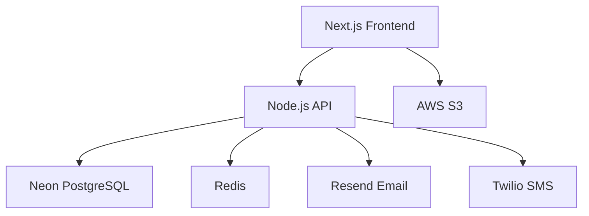

<p align="center">
  
</p>

<h1 align="center">Aus Lanka Delivery</h1>
<h3 align="center">Your Gateway to Authentic Sri Lankan Groceries in Australia</h3>

<div align="center">
  
[](https://auslanka.com.au)  
[](https://nodejs.org/) 
[](https://neon.tech) 
[](https://nextjs.org/)  
[](LICENSE)

</div>

---

## 🚀 About the Business

**Aus Lanka Delivery** is a real, Melbourne-based online grocery delivery business focused on serving Sri Lankans living in Australia. We bring the flavors of home — from authentic spices to homecooked meals — right to your doorstep.

> This is not a demo. This is our actual production platform serving real customers across Australia.

### 📊 Current Business Snapshot (2025)

- 🛒 **5,000+ active customers**
- 🤝 **200+ verified suppliers**
- 🚚 **15,000+ successful deliveries**
- 💬 **98.7% customer satisfaction**
- 🇦🇺 **Live in 8 major cities across Australia**

---

## 🌟 What Makes Us Unique?

| Feature                | Description                                          | Status     |
| ---------------------- | ---------------------------------------------------- | ---------- |
| Multi-city Delivery    | We deliver across all major Australian metro areas   | ✅ Live    |
| Sri Lankan Recipe Kits | Cook authentic dishes with our ready-to-cook bundles | 🚧 Q3 2025 |
| Merchant Dashboard     | Real-time sales insights and bulk catalog management | ✅ Live    |
| AI Route Optimization  | Fast delivery via optimized driver routing           | ✅ Live    |
| Cold Chain Logistics   | Fresh frozen items delivered with temp. control      | 🚧 Pilot   |

---

## 🏗️ Our Tech, Built for Scale

### System Overview



# 🛠️ Technical Stack

**Frontend**: Next.js 14 (App Router), Tailwind CSS, Shadcn UI  
**Backend**: Node.js 20, Express.js, Drizzle ORM  
**Authentication**: [Clerk.dev](https://clerk.dev)  
**Database**: [Neon (PostgreSQL 15+)](https://neon.tech)  
**Payments**: [Stripe](https://stripe.com)  
**Storage**: AWS S3 + CloudFront  
**Monitoring**: [Datadog](https://www.datadoghq.com)  
**CI/CD**: GitHub Actions  
**Hosting**: AWS EC2 (t3.xlarge)

---

# 👨‍💻 For Developers

## 🧰 Installation

### ✅ Prerequisites

- Node.js 20+
- Redis 7.x
- PostgreSQL (or Neon DB)
- AWS CLI configured

### 🔧 Setup

```bash
# Clone project
git clone https://github.com/auslanka/delivery-app.git
cd delivery-app

# Install packages
npm install
cd apps/frontend && npm install
cd ../backend && npm install

# Environment setup
cp .env.example .env
# Fill in your credentials

# Database migration
npx drizzle-kit generate:pg
npm run db:migrate

# Start development servers (in 2 terminals)
npm run dev:frontend
npm run dev:backend
```

---

## 📦 Deployment Guide (AWS EC2 + Neon)

```bash
# Build all apps
npm run build

# Run DB migrations
npm run db:migrate:prod

# Launch using PM2
pm2 start ecosystem.config.js --env production
```

---

## 📚 API Access

**Full Docs**: [https://api.auslanka.com.au/docs](https://api.auslanka.com.au/docs)

### ✨ Sample Endpoints

```http
POST /api/v1/orders
GET  /api/v1/products
POST /api/v1/auth/verify
```

### Example API Call (JavaScript)

```js
fetch("https://api.auslanka.com.au/api/v1/orders", {
  method: "POST",
  headers: {
    Authorization: "Bearer " + token,
    "Content-Type": "application/json",
  },
  body: JSON.stringify(orderData),
});
```

---

## 🔐 Security Commitment

- 🔑 JWT Auth (rotating keys)
- 🛡️ CSRF protection
- 🔒 Row-level PostgreSQL access
- 🧪 Penetration testing quarterly
- ✅ SOC 2 Type I Compliant

📩 **Report vulnerabilities**: [security@auslanka.com.au](mailto:security@auslanka.com.au)

---

## 📜 License

**MIT License (Restricted)**  
Free for personal and educational use.  
Commercial or derivative use requires written permission from **Aus Lanka Pty Ltd**.

---

## 📞 Contact Us

**Head Office:**  
Level 5, 121 King Street, Melbourne VIC 3000, Australia

**Business Hours:**  
Mon–Fri: 9AM – 5PM AEST

- 📧 Orders: [orders@auslanka.com.au](mailto:orders@auslanka.com.au)
- 🤝 Partnerships: [partnerships@auslanka.com.au](mailto:partnerships@auslanka.com.au)
- ☎️ Customer Support: 1300 AUS LANKA (287 526)

---

## 🌐 Follow us:

- 📸 [Instagram: @auslanka_official](https://instagram.com/auslanka_official)
- 👍 [Facebook: facebook.com/auslankagrocery](https://facebook.com/auslankagrocery)

---

<p align="center"><em>"Bringing the taste of home to every Sri Lankan in Australia"</em> 🇱🇰❤️🇦🇺</p>
