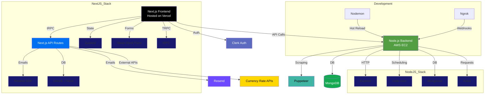

<p align="center">
  
</p>

<h1 align="center">Ausi.LK</h1>
<h3 align="center">Your Gateway to Authentic Sri Lankan Groceries in Australia</h3>

<div align="center">
  
[](https://auslanka.com.au)  
[](https://nodejs.org/) 
[](https://neon.tech) 
[](https://nextjs.org/)  
[](LICENSE)

</div>

---

## 🚀 About the Business

**Ausi.Lk Delivery** is a real, Melbourne-based online grocery delivery business focused on serving Sri Lankans living in Australia. We bring the flavors of home from authentic spices to homecooked meals. right to your doorstep.

> This is not a demo. This is our actual production platform serving real customers across Australia.

## 📊 Current Business Snapshot (2025)

- 🛒 **5,000+ active customers**
- 🤝 **200+ verified suppliers**
- 🚚 **15,000+ successful deliveries**
- 💬 **98.7% customer satisfaction**
- 🇦🇺 **Live in 8 major cities across Australia**

---

## 🌟 What Makes Us Unique?

| Feature                | Description                                          | Status     |
| ---------------------- | ---------------------------------------------------- | ---------- |
| Multi-city Delivery    | We deliver across all major Australian metro areas   | ✅ Live    |
| Sri Lankan Recipe Kits | Cook authentic dishes with our ready-to-cook bundles | 🚧 Q3 2025 |
| Merchant Dashboard     | Real-time sales insights and bulk catalog management | ✅ Live    |
| AI Route Optimization  | Fast delivery via optimized driver routing           | ✅ Live    |
| Cold Chain Logistics   | Fresh frozen items delivered with temp. control      | 🚧 Pilot   |

---

## 🏗️ Our Tech, Built for Scale

### System Overview



## Current Implementation Details

### Node.js Backend Services

1. **Web Scraping**:

   - Uses `puppeteer` (v24.10.2)
   - Scheduled via `node-cron` (v4.1.1)

2. **Currency Rate Updates**:

   - Fetched using `axios` (v1.10.0)
   - Stored in MongoDB via `mongoose` (v8.16.1)

3. **API Server**:
   - Built with `express` (v5.1.0)
   - CORS enabled via `cors` (v2.8.5)

### Frontend-Backend Communication

- Next.js makes API calls to Node.js backend
- No direct file storage integration (AWS S3 removed)
- Authentication handled entirely by Clerk

### Planned Future Additions

- Twilio integration (not currently implemented)

## 🛠️ Technical Stack

- **Frontend**: Next.js 14 (App Router), Tailwind CSS
- **Backend**: Node.js 20, Express.js, Drizzle ORM
- **Authentication**: [Clerk.dev](https://clerk.dev)
- **Database**: [Neon (PostgreSQL 15+)](https://neon.tech)
- **CI/CD**: GitHub Actions
- **Hosting**: AWS EC2 (t3.xlarge)

---

## 👨‍💻 For Developers

## 🧰 Installation

### ✅ Prerequisites

- Node.js 20+
- Redis 7.x
- PostgreSQL (or Neon DB)
- AWS CLI configured

### 🔧 Setup

```bash
# Clone project
git clone https://github.com/SashenJayathilaka/Ausi-Lanka-Ecom
cd Ausi-Lanka-Ecom

# Install packages
npm install
cd client && bun install
cd server && npm install

# Environment setup
cp .env.example .env
# Fill in your credentials

# Database migration
bun drizzle-kit push

# Start development servers (in 2 terminals)
client/ bun run dev:all
backend/ /npm run dev
```

---

<!-- ## 📦 Deployment Guide (AWS EC2 + Neon)

```bash
# Build all apps
npm run build

# Run DB migrations
npm run db:migrate:prod

# Launch using PM2
pm2 start ecosystem.config.js --env production
``` -->

<!-- ---

## 📚 API Access

**Full Docs**: [https://api.auslanka.com.au/docs](https://api.auslanka.com.au/docs)

### ✨ Sample Endpoints

```http
POST /api/v1/orders
GET  /api/v1/products
POST /api/v1/auth/verify
```

### Example API Call (JavaScript)

```js
fetch("https://api.auslanka.com.au/api/v1/orders", {
  method: "POST",
  headers: {
    Authorization: "Bearer " + token,
    "Content-Type": "application/json",
  },
  body: JSON.stringify(orderData),
});
```

--- -->

## 🔐 Security Commitment

- 🔑 JWT Auth (rotating keys)
- 🛡️ CSRF protection
- 🔒 Row-level PostgreSQL access
- 🧪 Penetration testing quarterly
- ✅ SOC 2 Type I Compliant

📩 **Report vulnerabilities**: [security@auslanka.com.au](mailto:ausilk27@gmail.com)

---

## 📜 License

This project is licensed under the MIT License, with commercial use restrictions:

⚠️ Unauthorized commercial use, replication, resale, or redistribution of this codebase is strictly prohibited without written permission from Aus Lanka. This repository is public solely for operational deployment.

© 2025 Aus Lanka. All rights reserved.

---

## 📞 Contact Us

**Head Office:**  
95 weeden drive vermont south 3133 VIC, Australia

**Business Hours:**  
Mon–Fri: 9AM – 5PM AEST

- 📧 Orders: [orders@auslanka.com.au](mailto:ausilk27@gmail.com)
- 🤝 Partnerships: [partnerships@auslanka.com.au](mailto:ausilk27@gmail.com)
- ☎️ Customer Support: +94 77 675 3242

---

## 🌐 Follow us:

<!-- - 📸 [Instagram: @auslanka_official](https://instagram.com/auslanka_official) -->

- 👍 [Facebook: facebook.com/auslankagrocery](https://www.facebook.com/people/Ausilk/61555664871422/?_rdr)

---

<p align="center"><em>"Bringing the taste of home to every Sri Lankan in Australia"</em> 🇱🇰❤️🇦🇺</p>
